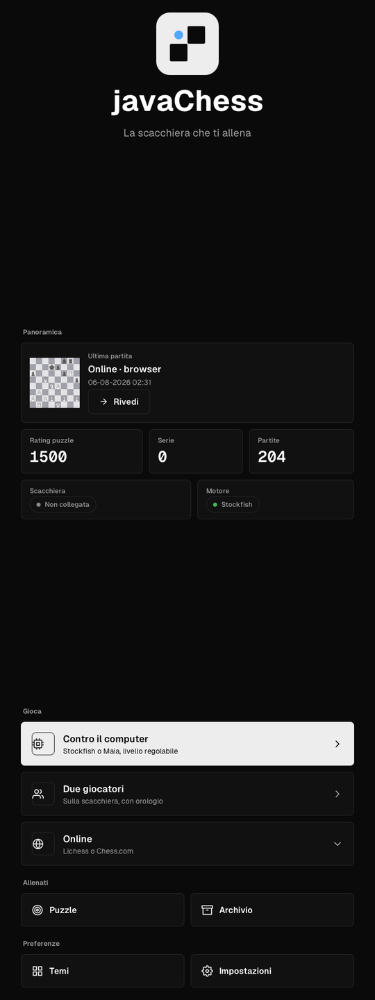
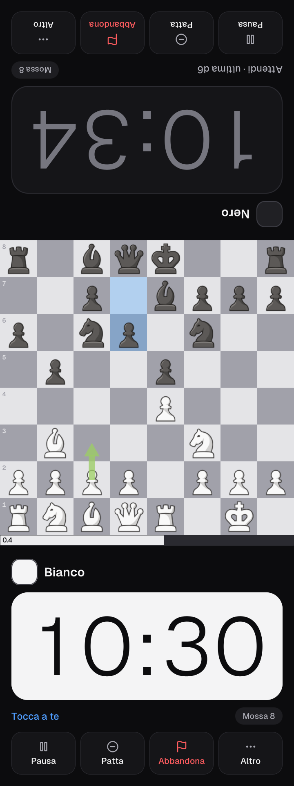
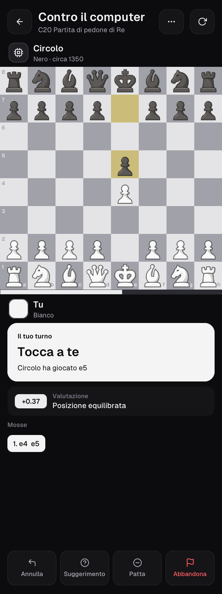
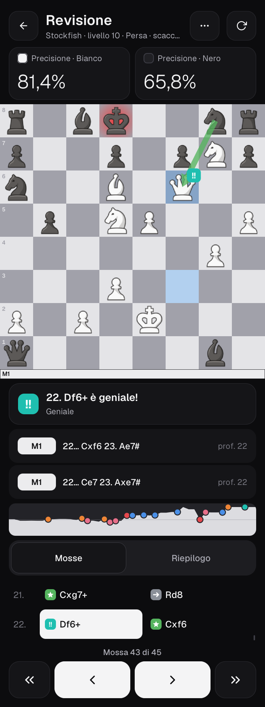
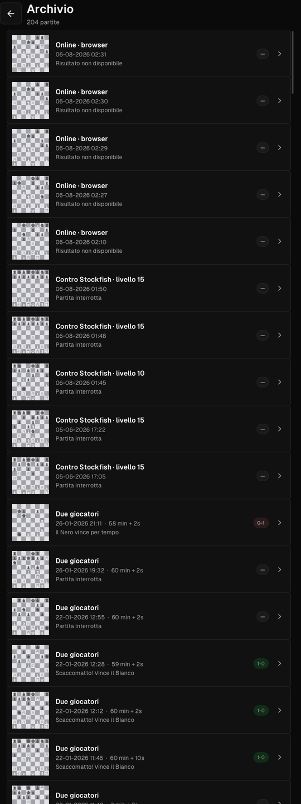
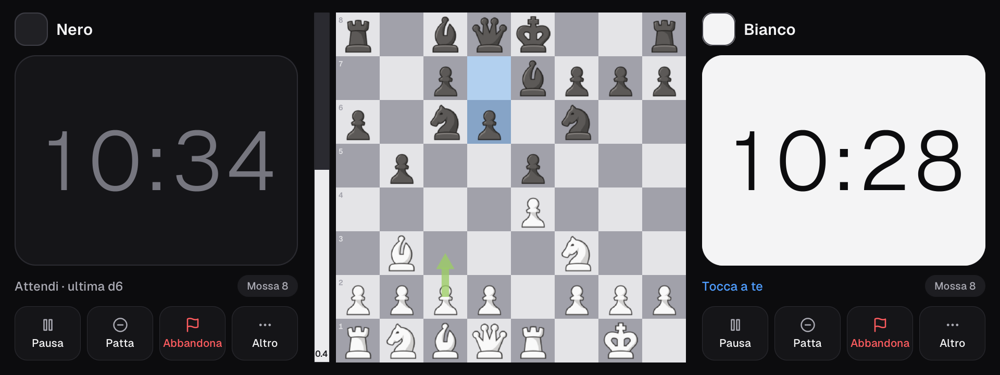

<p align="center">
  <picture>
    <source media="(prefers-color-scheme: dark)" srcset="docs/logo/javachess-logo-dark.svg">
    
  </picture>
</p>

<p align="center">
  <b>Software for a DIY smart chessboard</b> — play on a real board against Stockfish, Maia or people online,
  with sensors under every square and an LED that lights each one.
</p>

<p align="center">
  <a href="https://github.com/Hardin22/SmartChessboard/actions/workflows/ci.yml"></a>
  <a href="LICENSE"></a>
  
</p>

javaChess is a JavaFX application that runs on a Raspberry Pi built into a chessboard. 64 Hall-effect sensors read
where the pieces are, 64 RGB LEDs show moves, hints and the opponent's replies, and a tall touch screen beside the
board shows the clocks, the evaluation and the controls. The interface is designed for that screen: read from the
chair, used with the fingers, and turned towards whoever is playing — in a two-player game each player gets the
half of the screen that faces them. It also runs on a normal desktop (macOS, Linux) without any hardware, which is
how most development happens.

<p align="center">
  
  
  
  
  
</p>
<p align="center">
  
</p>

Dark and light themes (`*-light.png` in [docs/screenshots](docs/screenshots)), portrait 720×1920 board monitor,
landscape 1920×720 or a desktop window. The screenshots use a demo archive made of public-domain historical games;
accuracy and move labels are computed by the real review engine. Design principles and choices:
[docs/design/UX.md](docs/design/UX.md) and [docs/design/SUMMARY.md](docs/design/SUMMARY.md).

## Features

- **Play the computer**: Stockfish (skill 0–20, adjustable thinking time) or the human-like
  [Maia](https://maiachess.com) networks (1100, 1500, 1900 Elo) through lc0.
- **Two players** on the same board: one half of the screen per player, turned towards them, with a tournament
  clock (increments, pause), draw offers and resignation confirmed in the player's own half.
- **chess.com and lichess in the integrated browser** (JCEF): the screen is read by an on-device vision model, so the
  physical board stays in sync with games played on the website.
- **Lichess through the [Board API](https://lichess.org/api#tag/Board)** (Settings → Advanced): seek a game and play
  it with the physical pieces; the opponent's moves light up on the board for you to replicate.
- **Puzzles** from the Lichess puzzle database, filtered by theme and rating.
- **Game review**: accuracy for both sides, move labels (Geniale, Grande, Migliore … Errore grave) drawn as the app's
  own tiles, evaluation graph with the notable moves, best-move arrows, big step-through buttons and board drags.
- **Archive** of every game, grouped by day, with search (on-screen keyboard), filters by mode, result and period,
  and a preview to review, export (PGN) or delete a game.
- **Touch-first interface**: large type and 80 px+ targets, a rotate button in every screen (and a two-finger twist),
  automatic orientation towards the player, moves on the screen when no board is connected.
- **LED coaching**: legal moves when a piece is lifted, quality of the destination squares, check and mate effects.
- **Themes**: light/dark interface, several board and piece sets; Italian UI (strings in
  `src/main/resources/i18n/messages.properties`, ready for translations).

## Hardware

The board is a grid of 64 Hall sensors read through four 16-channel multiplexers by an Arduino, which also drives a
WS2812B LED strip. The Arduino talks to the Raspberry Pi over USB serial (250000 baud). The custom PCB is being
manufactured; the prototype below uses off-the-shelf modules.

### Bill of materials (indicative)

| Qty | Part | Notes |
|---|---|---|
| 1 | Raspberry Pi 4 or 5 (4–8 GB) | Runs the app. A desktop computer works too. |
| 1 | Display, 720×1920 (e.g. 8.8" IPS bar) or any HDMI screen | Touch is optional (mouse works). |
| 1 | Arduino Uno / Nano (ATmega328) | Firmware in [`firmware/smartboard/`](firmware/smartboard/smartboard.ino). |
| 4 | CD74HC4067 16-channel analog multiplexer | One per 16 squares. |
| 64 | A3144 (or similar) unipolar Hall-effect sensor | Active low; the Arduino enables internal pull-ups. |
| 32 | Neodymium magnet, ~6×3 mm | One glued under each piece (same pole facing down). |
| 64 | WS2812B LED (strip, 30 or 60/m, or single pixels) | Wired in a "snake" from A1 to H1, then H2 to A2... |
| 1 | 5 V power supply, ≥ 4 A | 64 LEDs at full white draw ~3.8 A; the firmware caps brightness. |
| 1 | 330 Ω resistor, 1000 µF capacitor | On the LED data line / across the LED supply. |
| 1 | USB cable Arduino ↔ Raspberry Pi | Serial link and Arduino power. |

### Wiring

| Arduino pin | Connection |
|---|---|
| D8, D9, D10, D11 | S0, S1, S2, S3 of **all four** multiplexers (shared address lines) |
| D4, D5, D6, D7 | SIG of multiplexer 1, 2, 3, 4 |
| D12 | WS2812B data in (through the 330 Ω resistor) |
| 5 V / GND | Multiplexers, sensors; LEDs from the external 5 V supply with a common ground |

The channel-to-square map is the `SQUARE_OF` table in the firmware; the order of the LEDs on the strip is set on
the app side (`led.layout`, `led.origin`, `led.direction`). `firmware/board-test/board-test.ino` is a bring-up
sketch for a new board: LED walk, colour order check and a live sensor monitor to fill in `SQUARE_OF`.

### Firmware and serial protocol

Flash [`firmware/smartboard/smartboard.ino`](firmware/smartboard/smartboard.ino) with the Arduino IDE or
`arduino-cli` (library: *Adafruit NeoPixel*). The board and the app speak a checksummed line protocol (v2) at
250000 baud: `+E4` / `-E4` when a piece is placed or lifted, a full occupancy heartbeat every second, LED frames
sent as deltas and acknowledged by the board. Everything — commands, flow control, latency budget, configuration —
is described in [docs/hardware-protocol.md](docs/hardware-protocol.md).

The app finds the Arduino by itself (ttyACM/ttyUSB on Linux, cu.usbmodem on macOS), reconnects when the cable is
unplugged, and works normally without a board: set-up and opponent-move steps complete on their own. For
development there is a software board (`-Djavachess.board=sim -Djavachess.simulator.window=true`) and a firmware
emulator on a pseudo-terminal (`firmware/emulator/board_emulator.py`).

## Installation

You need **Java 21** and **Stockfish**; the Maia bots additionally need **lc0** (their network weights are in
`engines/maia/`). `scripts/install-engines.sh` puts Stockfish (and with `--lc0` also lc0) in `engines/`; otherwise
the app looks in the `PATH`, `/opt/homebrew/bin`, `/usr/local/bin` and `/usr/games`, or where `stockfish.path` /
`lc0.path` point.

### macOS / Linux desktop

```bash
brew install openjdk@21 stockfish        # Debian/Ubuntu: sudo apt install openjdk-21-jdk stockfish
git clone https://github.com/Hardin22/SmartChessboard.git && cd SmartChessboard
./mvnw -DskipTests package
java -jar target/javaChess-1.0-SNAPSHOT.jar
```

### Raspberry Pi

Full guide (system packages, Java 21, display rotation, `run_pi.sh` options and why, kiosk start with systemd,
measured performance): [docs/raspberry-pi.md](docs/raspberry-pi.md) (Java 21 from Temurin — Raspberry Pi OS Bookworm ships
17 —, display rotation, `run_pi.sh` options, systemd kiosk service in `deploy/`). In short:

```bash
sudo apt install -y stockfish zstd unclutter
sudo usermod -aG dialout "$USER"                     # serial port access (log out and in again)
./mvnw -Ppi -Djavafx.platform=linux-aarch64 -DskipTests package   # the "pi" profile drops other platforms' natives
./run_pi.sh
```

### Puzzles

Puzzles come from the [Lichess puzzle database](https://database.lichess.org/#puzzles) (CC0) and are never
committed or packaged. Build the compact database once (about 410 MB, searches in well under a millisecond):

```bash
scripts/build-puzzle-db.sh --download data/puzzles.db
```

The app looks for it in `-Djavachess.puzzles=<file>`, `data/puzzles.db`, then `~/.javachess/puzzles.db`.

## Configuration

Everything the app stores lives in **`~/.javachess/`** (override with `-Djavachess.home=/path` or the
`JAVACHESS_HOME` environment variable):

| File / folder | Content |
|---|---|
| `config.properties` | Settings (mode 600: it can contain your Lichess token) |
| `archive.json` | Game archive (versioned JSON, every game also stored as PGN) |
| `backups/` | Automatic copies of the archive and of damaged files |
| `logs/javachess.log` | Log file, rotated daily (attach it to bug reports) |
| `jcef-cache/` | Integrated browser profile (cookies, chess.com / lichess login) |
| `cookies.json` | Cookies of the app's own HTTP requests |
| `puzzle-progress.json` | Puzzle attempts, puzzle rating, streaks |

Settings and archive written by older versions in the working directory are migrated automatically on first start
(the old archive is left untouched).

Most settings are changed from the *Settings* screen. Useful keys:

| Key | Default | Meaning |
|---|---|---|
| `stockfish.path`, `lc0.path` | searched | Engine executables (optional, see Installation) |
| `stockfish.threads`, `stockfish.hash` | automatic | Engine resources (threads, MB of hash); unset = sized from the machine |
| `game.bot.level` | 10 | Stockfish skill level (0–20) |
| `game.bot.movetime` | 2000 | Bot thinking time in ms |
| `game.default.duration`, `game.default.increment` | 10, 0 | Default clock for two-player games (minutes, seconds) |
| `game.depth`, `analysis.depth`, `move.eval.depth` | 18, 12, 8 | Search depth during games, review and LED hints |
| `game.evaluation`, `game.suggestions` | true | Show evaluation bar / best-move arrows |
| `hardware.led.brightness` | 100 | LED brightness in % |
| `lichess.username`, `lichess.token` | — | Lichess account and API token |
| `board.mode` | auto | `auto` (detect the Arduino), `sim` (software board), `off` |
| `board.port`, `board.baud` | detected, 250000 | Serial port of the Arduino and its speed |
| `led.layout`, `led.origin`, `led.direction` | snake, a1, ranks | How the LED strip is laid out under the board |

### Lichess

Use *Settings → Advanced → Lichess → Connect account*: the app opens the Lichess authorization page (OAuth with PKCE, no
password involved) and stores the resulting token. Alternatively, create a personal API token with the
**`board:play`** scope at
<https://lichess.org/account/oauth/token/create?scopes[]=board:play&description=javaChess> and paste it in
*Settings → Advanced*. It is stored only in `~/.javachess/config.properties` (owner-only permissions) and never logged.
For development you can also export `JAVACHESS_LICHESS_TOKEN`. The Board API only allows rapid and classical time
controls (at least 8 minutes).

### chess.com

There is no public API for playing on chess.com: open it from the home screen and log in once in the integrated
browser. The session is kept in `~/.javachess/jcef-cache`. **Passwords are never stored by javaChess.**

## Development

```bash
./mvnw test                     # unit + end-to-end tests (~1 min; engine tests skip without Stockfish)
./mvnw test -DskipE2E=true      # without the end-to-end tests (they open a window)
./mvnw test -De2e.headless=true # end-to-end tests without a window or display (JavaFX Monocle, software rendering)
./mvnw -DskipTests package      # runnable jar in target/
scripts/dev-run.sh              # run from the build directory, with developer switches:
scripts/dev-run.sh -Djavachess.windowed=1920x720 -Djavachess.view=REVIEW
scripts/dev-run.sh -Djavachess.screen=1 -Djavachess.snapshot=/tmp/home.png -Djavachess.snapshot.exit=true
```

**Tests.** Unit tests cover the data layer (archive migration, PGN, settings, atomic files), the Lichess client against
a local fake server (no network), the vision pipeline on a real lichess screenshot and synthetic boards, the engine
layer (a fake UCI process; Stockfish when installed), the board protocol and state machine (a firmware emulator), the
LED renderer and the clocks. The end-to-end tests in `src/test/java/**/e2e` start the real views and game classes
with no board and a deterministic UCI engine as a child process, and play: a game against the bot until checkmate
(archived), an engine switch during a game, a two-player game lost on time, puzzles solved and failed (progress
stored), the review of an archived game with accuracies, and the archive screen (open, export, delete). Further E2E
classes play every local mode to the end on the simulated board (`SimBoardEndToEndTest`: moves lifted and placed on
the sensors, bot moves reproduced, cable unplugged and plugged back, take-back, puzzle set up on the board) and run 20
games in a row checking that threads, engine processes and heap do not grow (`LongRunEndToEndTest`); two seeded
"monkey" walks (`RandomWalkEndToEndTest` on the screen, `SimRandomWalkEndToEndTest` on the simulated board with the
cable unplugged now and then) fail on any error in the log and print the seed to replay it. They need a
display (CI runs everything under `xvfb-run`) or `-De2e.headless=true`; on a machine without a display they are
skipped. QA notes: [docs/qa](docs/qa/SUMMARY.md).

| Switch | Effect |
|---|---|
| `-Djavachess.screen=N` | Open on screen N (0 = primary) |
| `-Djavachess.windowed=WxH` | Window of the given size instead of full screen |
| `-Djavachess.view=NAME` | Start on a view (HOME, PVC_SETUP, GAME, REVIEW, ARCHIVE, SETTINGS, ...) |
| `-Djavachess.snapshot=file.png` | Save a screenshot of the window after `javachess.snapshot.delayMs` ms |
| `-Djavachess.snapshot.size=1920x720` | Take that screenshot in an off-screen scene of the given size |
| `-Djavachess.demo=NAME` | Open a screen in a given state: `pvp`, `pvp-draw`, `pvp-end`, `pvc`, `pvc-black`, `pvc-replicate`, `review` (`-Djavachess.demo.analyze=true`), `archive-preview`, `puzzle`, ... (see `DevDemos`) |
| `-Djavachess.demo.seed=N` | With `-Djavachess.home=<empty dir>`: fill the archive with N demo games |
| `-Djavachess.rotated=true` | Start as if the monitor were mounted upside down |
| `-Djavachess.animations=off` | No screen transitions (for very slow software rendering) |
| `-Djavachess.home=DIR` | Use another data folder (handy to test the first-start migration) |
| `-Djavachess.log.level=DEBUG` | More logging |
| `-Djavachess.vision.debug=true` | Write annotated vision frames to `~/.javachess/vision-debug/` |
| `-Djavachess.board=sim` | Simulated sensor board (add `-Djavachess.simulator.window=true` to show it, with a cable unplug button) |
| `-Djavachess.sim.autoplay=N` | On the simulated board: set up the pieces, play N random moves (`-Djavachess.sim.autoplay.side=white\|black\|both`), reproduce the opponent's moves |
| `-Djavachess.exitAfterMs=N` | Quit normally after N ms (a game in progress is archived as interrupted and kept for resuming) |
| `-Djavachess.dev.pvc=e2e4,g1f3,...` | Scripted game against the bot without a board (see `DevScenario`) |
| `-Djavachess.reviewGame=latest` | Open the newest archived game in the review screen |
| `-Djavachess.metrics=true` | Log frame times and heap every 5 s |

### Architecture

```
io.github.hardin22.javachess
├── Application   entry point (App, Main), start-up (Bootstrap), lazy native libraries (NativeLibraries),
│                 developer switches and scripted scenarios (DevOptions, DevScenario, DevDemos), StartupMetrics
├── Components    the design system: Ui (building blocks and sizes), ScreenHeader, RotateButton, StatusCard,
│                 ClockFace, Stepper, TouchKeyboard, BoardFrame, ReviewLabels, ThemeManager (light/dark), I18n
├── Controllers   one Screen per view, built in code (MainController: navigation, orientation, sheets);
│                 GameSoloView / GameDuelView (game layouts); ArduinoController (facade over Hardware)
├── Engine        everything that talks to chess engines: EngineManager (owns the Stockfish/lc0 processes,
│                 profiles), UciClient (asynchronous UCI), PositionAnalyzer (live analysis), MoveCoach and
│                 MoveClassifier (move quality for the LEDs and the review), OpeningExplorer, EngineLocator
├── Hardware      the smart board: SerialBoard (USB serial, detection, reconnection), BoardProtocol (v2 lines),
│                 LedRenderer / LedMapping (layered LED frames), MoveLeds / MoveLedsFeedback (coach colours),
│                 SimulatedBoard and its window
├── Oggetti       game model and board widgets: AbstractGame → PvcGame, PvpGame, OnlineGame, PuzzleGame;
│                 ChessBoardUI, EvalBar, ChessClock, ArchivedGame
├── Services      BoardStateManager (physical board state machine), GameAnalyzer (review/accuracy),
│                 GameArchiveService (archive + PGN), LichessClient / LichessGameManager / LichessOAuth,
│                 PuzzleService / PuzzleDatabase / PuzzleProgressService, VisionService (screen reading loop)
├── Vision        PieceClassifier (YOLOv8 ONNX model), GridFinder (checker-pattern grid), BoardReading
│                 (per-square probabilities), PositionResolver (legal moves correct misread squares), BotMover
└── Utils         AppExecutors (io / compute / scheduler / storage threads), ConfigManager, AppPaths,
                  AtomicFiles, PgnCodec (UCI/SAN/FEN/PGN), ErrorReporter, ...
```

- **Threads**: the JavaFX thread only updates the UI. Engines (`UciClient` control/reader threads), serial I/O
  (`SerialBoard`), LED rendering, network, vision and file writes (`AppExecutors.storage()`, drained on exit) run
  in the background and report back with `Platform.runLater`.
- **Engines** are started lazily and reused (never one process per move); a missing or crashing engine is reported
  and restarted instead of freezing the game.
- **Physical board**: `BoardStateManager` turns sensor events into legal moves (castling and en passant in any
  lifting order) and drives the LEDs for set-up, hints, move quality and the opponent's replies.
- **Vision**: the screen is captured, the YOLOv8 model finds the board and the pieces (grey scale with contrast
  normalisation), `GridFinder` snaps the board to the exact 8×8 checker pattern, each square gets a probability for
  each piece, and `PositionResolver` picks the legal move that best explains the picture, so a misread square does not
  break the sync. Tests measure it on real lichess screenshots and on synthetic boards in several themes and lighting
  conditions (square accuracy 99.8%).
- **Data**: settings, archive and puzzle progress are written atomically (temporary file + rename) with automatic
  backups; unreadable files are moved aside, never overwritten.

## Contributing

Contributions are welcome — see [CONTRIBUTING.md](CONTRIBUTING.md) and the [code of conduct](CODE_OF_CONDUCT.md).
Security issues: see [SECURITY.md](SECURITY.md).

Known limitations:
- Lichess games through the Board API are limited to rapid and classical time controls (Lichess rule); faster games
  can be played on lichess.org in the integrated browser.
- chess.com has no playing API: its games are followed by reading the screen, so the board must be visible.
- The vision model was trained on 2D web boards; unusual piece sets may need the checker-pattern fallback or retraining.

## License

javaChess is free software, released under the **GNU General Public License v3.0 or later** ([LICENSE](LICENSE)).
GPL-3.0 was chosen because the app is built around Stockfish, lc0 and the Maia networks (all GPL-3.0) and must stay
compatible with them, while all the libraries it links (Apache-2.0, MIT, BSD, EPL/LGPL, OFL, public domain) can be
combined with GPL-3.0 code.

Third-party components:

| Component | License |
|---|---|
| [chesslib](https://github.com/bhlangonijr/chesslib) | Apache-2.0 |
| OpenJFX | GPL-2.0 with Classpath Exception |
| [jcefmaven](https://github.com/jcefmaven/jcefmaven) / CEF / Chromium | Apache-2.0 / BSD-3-Clause |
| OpenCV (openpnp build), ONNX Runtime | Apache-2.0, MIT |
| Logback, SLF4J | EPL-1.0 / LGPL-2.1, MIT |
| jSerialComm, Ikonli, Unirest, org.json | Apache-2.0 / LGPL-3.0, Apache-2.0, MIT, public domain |
| Stockfish, lc0, Maia weights (`engines/maia/`) | GPL-3.0 |
| Vision model `src/main/resources/models/best.onnx` | trained with Ultralytics YOLOv8 (AGPL-3.0); dataset "2D Chessboard and Chess Pieces" (Roboflow Universe) |
| Lichess puzzle database | CC0 |
| Fonts Geist and Geist Mono (Vercel, `src/main/resources/Font/`) | SIL Open Font License 1.1 |
| Feather icons (via Ikonli) | MIT |
